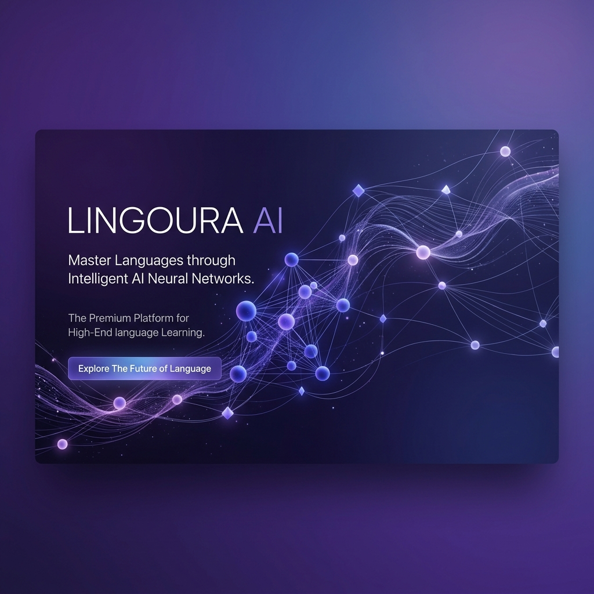

<div align="center">



# 🌌 Lingoura AI
### The Intelligent Bridge to English Fluency

[](https://opensource.org/licenses/MIT)
[](https://nextjs.org/)
[](https://tailwindcss.com/)
[](https://www.framer.com/motion/)

**Lingoura AI** helps you organize lessons, generate notes, create quizzes, and stay on track — all powered by AI. Experience a state-of-the-art platform designed to master English fluency through interactive labs and real-time intelligence analytics.

[Explore Dashboard](http://localhost:3000/dashboard) • [View Lessons](http://localhost:3000/lessons) • [Documentation](#)

</div>

---

## 🚀 Key Modules

<table>
  <tr>
    <td width="50%">
      <h3>📊 Fluency Analytics</h3>
      <p>Precision tracking of CEFR levels across all four core domains. Understand your growth with data-driven insights and AI-predicted trajectories.</p>
    </td>
    <td width="50%">
      <h3>🎙️ Speaking Lab</h3>
      <p>Interactive oral practice sessions. High-fidelity feedback on pronunciation, grammar, and professional delivery in real-time.</p>
    </td>
  </tr>
  <tr>
    <td width="50%">
      <h3>🎧 Listening Lab</h3>
      <p>Immersive audio environments. Sharpen your comprehension through diverse accents and complex professional scenarios.</p>
    </td>
    <td width="50%">
      <h3>✍️ Writing Intelligence</h3>
      <p>AI-assisted writing practice that generates personalized notes, corrects advanced syntax, and builds your technical vocabulary.</p>
    </td>
  </tr>
</table>

---

## 💎 Design & UX Excellence

Lingoura AI is built with a **Premium SaaS Aesthetic**, focusing on deep work and cognitive ease:

- **🎭 Adaptive Theming**: Seamless switching between a crisp Professional Light mode and a deep, focused Dark mode.
- **✨ Motion Sync**: A mathematically synchronized layout engine using Framer Motion for weightless transitions.
- **🛡️ Secure Intelligence**: End-to-end encrypted processing for all your AI-generated lessons and notes.
- **🔍 Search-First UI**: Global intelligence search (Cmd + K) to access any note, quiz, or lesson instantly.

---

## 🛠️ Technical Foundation

Built with the latest state-of-the-art web technologies:

- **Core**: Next.js 15 (App Router)
- **Styling**: Tailwind CSS v4 (High-performance engine)
- **Animation**: Framer Motion 11+
- **Icons**: Lucide React
- **Theming**: Next Themes with custom CSS variable synchronization

---

## 🏁 Getting Started

1. **Clone the project**
   ```bash
   git clone https://github.com/kumaresh-rgb/lingoura-ai.git
   ```

2. **Install dependencies**
   ```bash
   npm install
   ```

3. **Launch Intelligence Base**
   ```bash
   npm run dev
   ```

---

<div align="center">
  Developed with ❤️ by <a href="https://github.com/kumaresh-rgb">Kumaresh</a>
</div>
