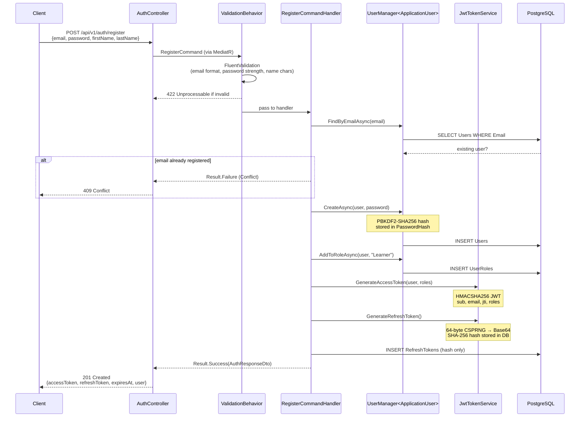
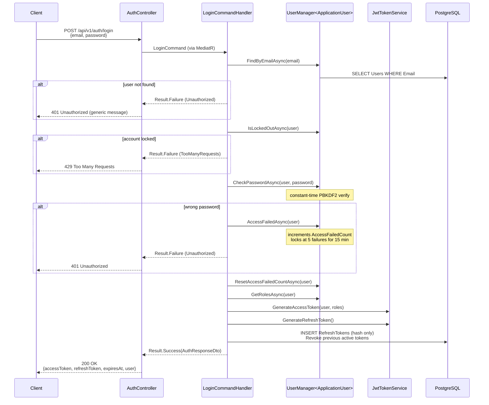
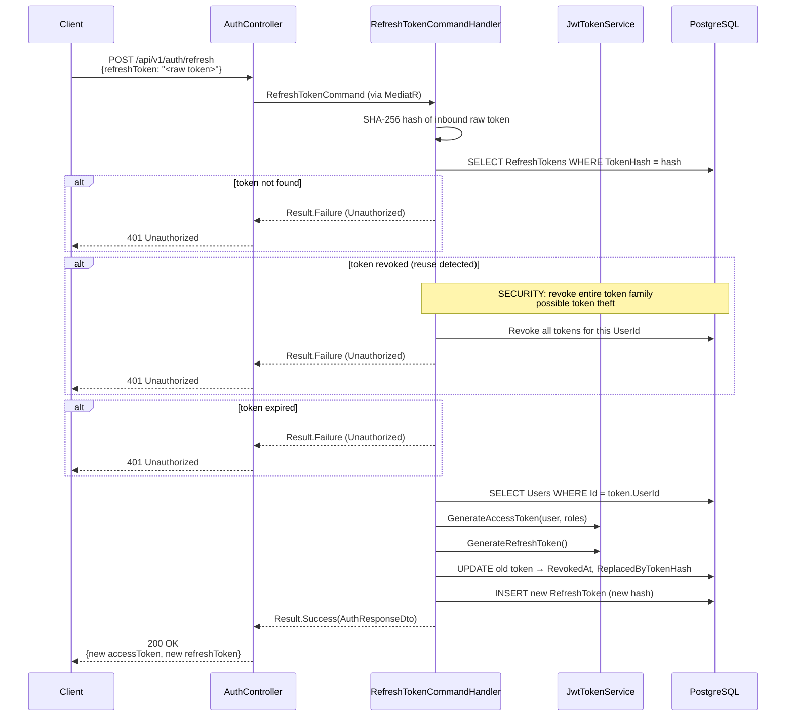
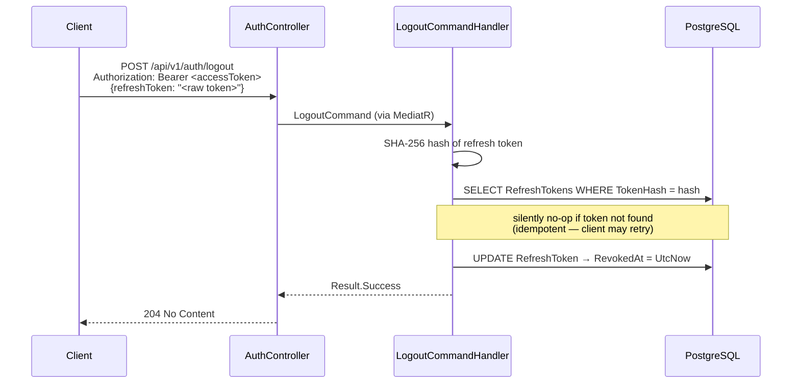
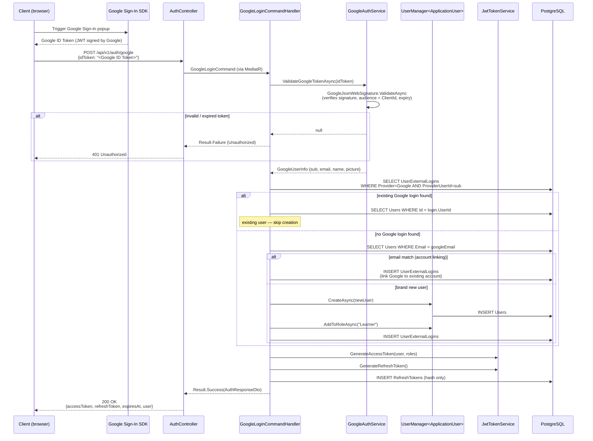
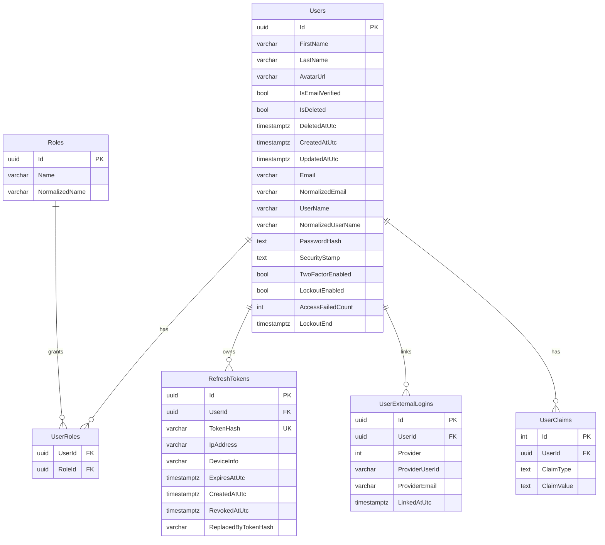

# Lingoura Backend — Architecture & Auth Reference

## Table of Contents
1. [Folder Structure](#folder-structure)
2. [Layer Rules](#layer-rules)
3. [Authentication Flows](#authentication-flows)
   - [Registration](#1-registration)
   - [Login](#2-login)
   - [Token Refresh](#3-token-refresh)
   - [Logout](#4-logout)
   - [Google OAuth](#5-google-oauth)
4. [Database Schema](#database-schema)
5. [Middleware Pipeline](#middleware-pipeline)
6. [Configuration & Secrets](#configuration--secrets)

---

## Folder Structure

```
backend/
├── Lingoura.sln
├── docker-compose.yml
├── docker-compose.override.yml
├── ARCHITECTURE.md                          ← this file
│
└── src/
    ├── Lingoura.Domain/                     ← core business entities, no dependencies
    │   ├── Entities/
    │   │   ├── ApplicationUser.cs           ← IdentityUser<Guid> + soft-delete + audit
    │   │   ├── ApplicationRole.cs           ← IdentityRole<Guid>
    │   │   ├── RefreshToken.cs              ← SHA-256 hashed, rotate-on-use
    │   │   └── UserExternalLogin.cs         ← Google / Apple / Microsoft links
    │   ├── Enums/
    │   │   ├── AuthProvider.cs              ← Local, Google, Apple, Microsoft
    │   │   └── UserRole.cs                  ← Learner, Instructor, Admin
    │   └── Events/
    │       └── UserRegisteredDomainEvent.cs
    │
    ├── Lingoura.Common/                     ← cross-cutting utilities, no dependencies
    │   ├── Results/
    │   │   ├── Result.cs                    ← Result<T> monad
    │   │   └── Error.cs                     ← typed error record
    │   ├── Exceptions/
    │   │   ├── DomainException.cs           ← abstract base
    │   │   ├── ValidationException.cs
    │   │   ├── NotFoundException.cs
    │   │   ├── UnauthorizedException.cs
    │   │   ├── ForbiddenException.cs
    │   │   ├── ConflictException.cs
    │   │   └── TooManyRequestsException.cs
    │   ├── Helpers/
    │   │   └── CryptoHelper.cs              ← GenerateSecureToken, HashToken, SecureEquals
    │   ├── Constants/
    │   │   ├── AuthConstants.cs             ← expiry, lockout, length limits
    │   │   └── ClaimTypeNames.cs
    │   └── Extensions/
    │       ├── ClaimsPrincipalExtensions.cs
    │       └── StringExtensions.cs
    │
    ├── Lingoura.Shared/                     ← API contracts & DTOs shared across projects
    │   └── Responses/
    │       └── ApiResponse.cs               ← ApiResponse<T>, ApiResponse (non-generic)
    │
    ├── Lingoura.Application/                ← CQRS use cases, no framework deps
    │   ├── DependencyInjection.cs           ← MediatR + FluentValidation + behaviors
    │   ├── Common/
    │   │   ├── Behaviors/
    │   │   │   ├── ValidationBehavior.cs    ← runs all IValidator<T> before handler
    │   │   │   └── LoggingBehavior.cs       ← logs request/response names
    │   │   ├── Interfaces/
    │   │   │   ├── IApplicationDbContext.cs
    │   │   │   ├── ITokenService.cs
    │   │   │   ├── IGoogleAuthService.cs
    │   │   │   ├── ICurrentUserService.cs
    │   │   │   └── IDateTimeProvider.cs
    │   │   └── Models/
    │   │       ├── TokenResult.cs
    │   │       └── GoogleUserInfo.cs
    │   └── Authentication/
    │       ├── Commands/
    │       │   ├── Register/                ← RegisterCommand + Handler + Validator
    │       │   ├── Login/                   ← LoginCommand + Handler + Validator
    │       │   ├── RefreshToken/            ← RefreshTokenCommand + Handler + Validator
    │       │   ├── Logout/                  ← LogoutCommand + Handler
    │       │   └── GoogleLogin/             ← GoogleLoginCommand + Handler + Validator
    │       └── DTOs/
    │           ├── AuthResponseDto.cs
    │           ├── RegisterRequestDto.cs
    │           ├── LoginRequestDto.cs
    │           ├── RefreshTokenRequestDto.cs
    │           └── GoogleLoginRequestDto.cs
    │
    ├── Lingoura.Infrastructure/             ← EF Core, Identity, JWT, Google, options
    │   ├── Extensions/
    │   │   └── InfrastructureServiceExtensions.cs  ← all DI wiring
    │   ├── Options/
    │   │   ├── JwtOptions.cs
    │   │   ├── GoogleAuthOptions.cs
    │   │   └── DatabaseOptions.cs
    │   ├── Authentication/
    │   │   ├── JwtTokenService.cs           ← HMACSHA256 JWT, refresh token generation
    │   │   └── GoogleAuthService.cs         ← GoogleJsonWebSignature.ValidateAsync
    │   ├── Services/
    │   │   ├── CurrentUserService.cs        ← reads sub claim from HttpContext
    │   │   └── DateTimeProvider.cs          ← wraps DateTime.UtcNow for testability
    │   └── Persistence/
    │       ├── ApplicationDbContext.cs      ← IdentityDbContext<ApplicationUser, ApplicationRole, Guid>
    │       ├── DatabaseSeeder.cs            ← seeds Learner/Instructor/Admin roles at startup
    │       ├── Configurations/
    │       │   ├── ApplicationUserConfiguration.cs  ← soft-delete filter, column lengths
    │       │   ├── RefreshTokenConfiguration.cs     ← unique index on TokenHash
    │       │   └── UserExternalLoginConfiguration.cs ← unique (Provider, ProviderUserId)
    │       ├── Interceptors/
    │       │   └── AuditSaveChangesInterceptor.cs   ← auto-sets CreatedAtUtc / UpdatedAtUtc
    │       └── Migrations/                  ← EF Core migration history (always committed)
    │           ├── 20260516070225_InitialCreate.cs
    │           ├── 20260516070225_InitialCreate.Designer.cs
    │           └── ApplicationDbContextModelSnapshot.cs
    │
    └── Lingoura.Api/                        ← HTTP entry point only
        ├── Program.cs                       ← host setup, middleware pipeline, startup checks
        ├── DesignTimeDbContextFactory.cs    ← enables dotnet ef without running the host
        ├── Controllers/
        │   └── V1/
        │       └── AuthController.cs        ← register, login, refresh, logout, google
        └── Middleware/
            ├── GlobalExceptionMiddleware.cs ← maps exceptions → HTTP status codes
            ├── CorrelationIdMiddleware.cs   ← X-Correlation-Id header propagation
            └── SecurityHeadersMiddleware.cs ← HSTS headers on every response
```

---

## Layer Rules

```
Domain        ←  no dependencies
Common        ←  no dependencies
Shared        ←  no dependencies
Application   ←  Domain, Common, Shared
Infrastructure←  Application, Domain, Common
Api           ←  Application, Infrastructure, Shared, Common
```

Application never references Infrastructure. Controllers never contain business logic — they only translate HTTP ↔ MediatR commands.

---

## Authentication Flows

### 1. Registration



---

### 2. Login



---

### 3. Token Refresh



---

### 4. Logout



---

### 5. Google OAuth (Backend-Validated)



---

## Database Schema



All `timestamp` columns are `timestamptz` (UTC). Soft-delete via `IsDeleted` + `DeletedAtUtc` — EF global query filter excludes deleted users and their related tokens/logins automatically.

---

## Middleware Pipeline

Request flows through middleware in this exact order (order is critical):

```
Incoming Request
       │
       ▼
 GlobalExceptionMiddleware    ← catches all unhandled exceptions → ApiResponse JSON
       │
       ▼
 CorrelationIdMiddleware       ← read/generate X-Correlation-Id; push to Serilog context
       │
       ▼
 SecurityHeadersMiddleware     ← X-Content-Type-Options, X-Frame-Options, CSP, etc.
       │
       ▼
 SerilogRequestLogging         ← structured HTTP access log
       │
       ▼
 HttpsRedirection
       │
       ▼
 CORS (LingouraPolicy)
       │
       ▼
 RateLimiter                   ← global: 100/min | auth endpoints: 10/min
       │
       ▼
 Authentication (JWT Bearer)
       │
       ▼
 Authorization
       │
       ▼
 Controllers → MediatR → Handler
       │
       ▼
Outgoing Response
```

Exception → HTTP status mapping (in `GlobalExceptionMiddleware`):

| Exception                  | HTTP Status |
|---------------------------|-------------|
| `ValidationException`     | 422         |
| `NotFoundException`       | 404         |
| `UnauthorizedException`   | 401         |
| `ForbiddenException`      | 403         |
| `ConflictException`       | 409         |
| `TooManyRequestsException`| 429         |
| anything else             | 500         |

---

## Configuration & Secrets

All secrets arrive via .NET User Secrets (dev) or environment variables (prod). **Nothing sensitive is in `appsettings.json`.**

| Config key                     | Source                      | Example value                          |
|-------------------------------|-----------------------------|----------------------------------------|
| `Database:ConnectionString`   | User Secrets / env var      | `Host=...;Port=5432;Database=lingoura` |
| `Jwt:SecretKey`               | User Secrets / env var      | 256-bit random base64 string           |
| `GoogleAuth:ClientId`         | User Secrets / env var      | `xxxx.apps.googleusercontent.com`      |
| `Jwt:Issuer`                  | `appsettings.json`          | `https://api.lingoura.ai`              |
| `Jwt:Audience`                | `appsettings.json`          | `https://app.lingoura.ai`              |
| `RateLimit:AuthEndpointsPerMinute` | `appsettings.json`    | `10`                                   |

Environment variable override format (12-factor): `Database__ConnectionString`, `Jwt__SecretKey`.

Set secrets locally:
```bash
cd backend
dotnet user-secrets set "Database:ConnectionString" "Host=localhost;Port=5432;..." --project src/Lingoura.Api
dotnet user-secrets set "Jwt:SecretKey" "<256-bit-random>" --project src/Lingoura.Api
dotnet user-secrets set "GoogleAuth:ClientId" "<your-client-id>" --project src/Lingoura.Api
```
