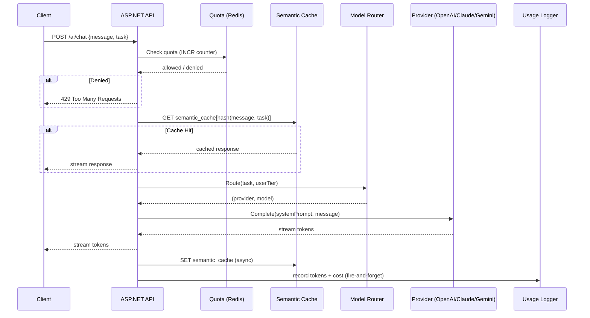
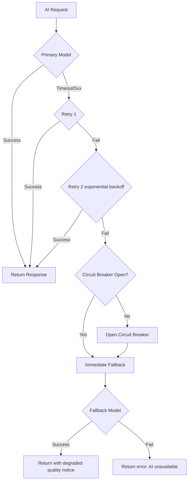
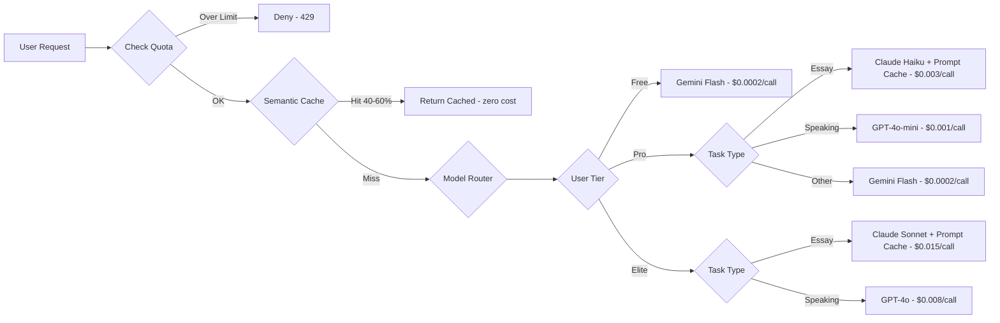

# Lingoura AI — Multi-Model AI Architecture

**Audience:** Engineering, Product, and Founders  
**Scope:** AI provider strategy, routing, cost optimization, and backend architecture for the Lingoura AI IELTS preparation platform

---

## Executive Summary

Lingoura AI requires three distinct AI capabilities: natural conversation for speaking practice, deep analytical reasoning for essay evaluation, and cost-efficient content generation for vocabulary and grammar drills. No single provider excels at all three with acceptable cost. The strategy is a smart routing layer that sends each task to the cheapest model capable of doing it well. With aggressive caching and prompt optimization, AI costs can be reduced by 70–80% versus a naive single-provider approach.

**Starting recommendation:** Gemini 1.5 Flash for Free users (near-zero cost), GPT-4o-mini for Pro speaking, Claude Sonnet for Pro/Elite writing evaluation. This combination gives the best quality-to-cost ratio for an IELTS SaaS.

---

## AI Provider Comparison

### OpenAI GPT-4o / GPT-4o-mini

GPT-4o-mini is the best value model in the market right now. At $0.15/M input tokens and $0.60/M output, it handles conversational tasks extremely well. The real-time audio API makes it the only viable choice for live speaking practice with instant feedback. The function-calling reliability is best-in-class for structured IELTS scoring output. GPT-4o (full) costs ~33× more per token than 4o-mini and is only justified for elite-tier speaking simulation or advanced mock interviews where naturalness is worth paying for.

**Strengths:** Conversational quality, audio API, function calling, low latency (200–500ms streaming), IELTS rubric adherence  
**Weaknesses:** Expensive for high-volume tasks, no native multimodal document understanding as strong as Gemini  
**Cost:** mini at $0.15/$0.60 per M tokens; full at $5/$15 per M tokens

### Anthropic Claude 3.5 Sonnet / Claude 3 Haiku

Claude is the gold standard for writing evaluation. Its 200K context window means it can analyze entire IELTS essays (often 1,000–3,000 words) with surrounding rubric context without truncation. The quality of feedback it gives on Coherence and Cohesion, Grammatical Range, Lexical Resource, and Task Achievement is measurably better than GPT or Gemini in blind evaluations. Claude Haiku 3.5 at $0.80/$4.00 per M tokens is competitive for mid-tier usage. Anthropic's prompt caching reduces system prompt cost by 90% — a critical advantage since IELTS evaluation prompts are long (1,500–2,000 tokens).

**Strengths:** Long-context analysis, writing quality, nuanced feedback, prompt caching (90% system prompt cost reduction), low hallucination rate on factual scoring  
**Weaknesses:** No native audio, higher latency for streaming (600–900ms first token), slightly more expensive than GPT-mini  
**Cost:** Haiku at $0.80/$4.00 per M; Sonnet at $3/$15 per M; cached tokens at $0.30/$3.75 per M

### Google Gemini 1.5 Flash / Pro

Gemini Flash is effectively the cheapest capable model available ($0.075/$0.30 per M tokens). For Free tier users who need basic AI feedback, Flash is the right default. Its 1M token context window is unmatched for document analysis — PDF reading passages, audio transcripts, and images can all be sent in a single prompt. However, its IELTS-specific reasoning quality is noticeably lower than Claude for writing evaluation, and its conversational English sounds more mechanical than GPT.

**Strengths:** Cheapest capable model, 1M context window, native multimodal (images, PDF, audio), Google's infrastructure (highest uptime), great for grammar drills and vocabulary  
**Weaknesses:** Lower writing feedback quality, more mechanical conversation, slower to adopt IELTS rubric conventions  
**Cost:** Flash at $0.075/$0.30 per M; Pro at $3.50/$10.50 per M

---

## Model Assignment by Tier and Task

| Task | Free | Pro | Elite |
|------|------|-----|-------|
| AI Chat (general) | Gemini Flash | GPT-4o-mini | GPT-4o |
| Speaking Practice | Gemini Flash | GPT-4o-mini | GPT-4o |
| Essay Evaluation | Gemini Flash | Claude Haiku | Claude Sonnet |
| Writing Feedback | Gemini Flash | Claude Haiku | Claude Sonnet |
| Grammar Correction | Gemini Flash | Gemini Flash | GPT-4o-mini |
| Vocabulary Learning | Gemini Flash | Gemini Flash | GPT-4o-mini |
| Reading Comprehension | Gemini Flash | Gemini Pro | Gemini Pro |
| PDF / Document Analysis | Gemini Flash | Gemini Pro | Gemini Pro |
| Mock Test / Interview | Not available | GPT-4o-mini | GPT-4o |
| Pronunciation Analysis | Not available | GPT-4o-mini (audio) | GPT-4o (audio) |

This table ensures Free users get a usable experience without negative margins, Pro users get genuine quality uplift that justifies ₹1,599/month, and Elite users get the best possible IELTS coaching experience.

---

## Cost Analysis

### Per-user monthly estimate (moderate usage)

Free user (5 AI chats/day × 30 days = 150 interactions at avg 800 tokens each):
- 120,000 input tokens + 60,000 output tokens through Gemini Flash
- Cost: ≈ $0.009 + $0.018 = **$0.027/user/month** (negligible)

Pro user (100 chats/day, 20 essays/month, 30 speaking sessions):
- AI chat (GPT-4o-mini): 3M input + 1.5M output = $0.45 + $0.90 = $1.35
- Essay evaluation (Claude Haiku, with caching): 500K input + 300K output = $0.40 + $1.20 = $1.60 (before caching savings)
- With 90% prompt cache hit: essay cost ≈ $0.45 (cached) + $0.12 (uncached) = $0.57
- Speaking (GPT-4o-mini): 1M tokens = $0.30
- Total raw AI cost per Pro user: **~$2.20/month**
- Revenue: ₹1,599 ≈ $19/month
- AI cost as % of revenue: **~11.6%**
- Gross margin before infra: **~88%**

Elite user (unlimited sessions, Claude Sonnet essays, GPT-4o speaking):
- AI cost: ~$12–15/month
- Revenue: ₹3,299 ≈ $39/month
- AI cost as % of revenue: **~35%**
- Gross margin before infra: **~65%**

These are conservative estimates. With Redis semantic caching (described below), real costs drop by an additional 40–60%.

### Cost Reduction Strategy

**Prompt Caching (most impactful):** Anthropic's prompt caching charges $0.30/M for cached input vs $3.00/M for regular input — a 90% reduction on the system prompt portion. An IELTS essay evaluation system prompt is ~1,800 tokens. At 10,000 essay evaluations/month, caching that prompt alone saves $50/month. The cache lasts 5 minutes and is refreshed automatically. Mark the system prompt with the `cache_control: {"type": "ephemeral"}` breakpoint.

**Semantic Caching in Redis:** Grammar explanations, vocabulary definitions, and common IELTS rubric explanations are highly repetitive. A user asking "what does coherence mean in IELTS?" generates the same answer as another user asking the same question. Embed the query with a lightweight model (text-embedding-3-small at $0.02/M tokens), find the nearest cache hit in Redis using cosine similarity (StackExchange.Redis + HNSW index or an Upstash Vector index), and return the cached response if similarity exceeds 0.92. This yields 40–60% cache hit rates on vocabulary and grammar tasks.

**Context Compression:** Before each AI call, summarize the last N conversation turns into a compact history. GPT-4o-mini can summarize 10 turns into 200 tokens in under 200ms for $0.0003. This prevents unbounded token growth in long sessions.

**Batch API:** For non-real-time tasks (essay grading queue, vocabulary list generation, test scoring), use OpenAI's Batch API or Anthropic's Message Batches API. These are 50% cheaper than standard API calls and have 24-hour turnaround. A scheduled job can batch-process all essay evaluations queued in the last hour.

**Model Downgrade on Retry:** If GPT-4o fails, retry with GPT-4o-mini. If Claude Sonnet fails, retry with Claude Haiku. Never retry with the same expensive model twice.

---

## AI Gateway Architecture

The backend implements a single `IAiGateway` abstraction that all application code calls. The gateway handles routing, caching, quota enforcement, and failover transparently.

```
User Request
     │
     ▼
AI Gateway (IAiGateway)
     │
     ├─► Quota Check (Redis) ─── DENY if exceeded
     │
     ├─► Semantic Cache (Upstash Vector / Redis) ─── HIT: return cached
     │
     ├─► Model Router ─── selects provider + model based on task + tier
     │
     ├─► Provider Adapter ─── OpenAI / Anthropic / Gemini
     │         │
     │    [Error?] ─► Fallback Provider (next tier down)
     │         │
     │    [Error?] ─► Circuit Breaker open → return graceful error
     │
     ├─► Cache Store (Redis) ─── write result
     │
     ├─► Usage Recorder (fire-and-forget) ─── Redis counter + DB async
     │
     └─► Streaming Response → Client
```

### Provider Abstraction Layer

Each AI provider is wrapped in an adapter implementing `IAiProvider`:

```csharp
public interface IAiProvider
{
    string ProviderName { get; }
    bool Supports(AiTask task);
    IAsyncEnumerable<string> StreamAsync(AiRequest request, CancellationToken ct);
    Task<AiResponse> CompleteAsync(AiRequest request, CancellationToken ct);
}
```

Concrete adapters: `OpenAiAdapter`, `AnthropicAdapter`, `GeminiAdapter`. Each adapter handles authentication, retry logic, timeout, and provider-specific request/response mapping. No application code ever talks to a provider directly.

### Model Router

The router takes `(userId, task, userTier)` and returns `(provider, model, systemPrompt)`:

```csharp
public sealed class AiModelRouter
{
    public ProviderModel Route(AiTask task, SubscriptionPlan tier)
    {
        return (task, tier) switch
        {
            (AiTask.EssayEvaluation, SubscriptionPlan.Elite)      => (Provider.Anthropic, "claude-sonnet-4-6"),
            (AiTask.EssayEvaluation, SubscriptionPlan.Pro)        => (Provider.Anthropic, "claude-haiku-4-5-20251001"),
            (AiTask.EssayEvaluation, _)                           => (Provider.Gemini,    "gemini-1.5-flash"),
            (AiTask.SpeakingPractice, SubscriptionPlan.Elite)     => (Provider.OpenAI,   "gpt-4o"),
            (AiTask.SpeakingPractice, SubscriptionPlan.Pro)       => (Provider.OpenAI,   "gpt-4o-mini"),
            (AiTask.SpeakingPractice, _)                          => (Provider.Gemini,   "gemini-1.5-flash"),
            (AiTask.AiChat, SubscriptionPlan.Elite)               => (Provider.OpenAI,   "gpt-4o"),
            (AiTask.AiChat, SubscriptionPlan.Pro)                 => (Provider.OpenAI,   "gpt-4o-mini"),
            (AiTask.DocumentAnalysis, _)                          => (Provider.Gemini,   "gemini-1.5-pro"),
            (AiTask.GrammarCorrection, _)                         => (Provider.Gemini,   "gemini-1.5-flash"),
            _                                                     => (Provider.Gemini,   "gemini-1.5-flash"),
        };
    }
}
```

### Failover Strategy

Each provider call is wrapped in a resilience pipeline using Polly:

1. **Timeout:** 30 seconds for standard calls, 60 for streaming
2. **Retry:** 2 retries with exponential backoff (1s, 3s) on 429 (rate limit) and 5xx errors
3. **Circuit Breaker:** Opens after 5 consecutive failures in 30 seconds. Stays open for 60 seconds. When open, the model router immediately selects the next fallback provider.
4. **Fallback chain:** Elite → if GPT-4o fails → GPT-4o-mini → if that fails → Gemini Flash + user notified

Circuit breaker state is stored in Redis with a TTL so it's shared across all API instances (important in a horizontally-scaled deployment).

---

## Backend Architecture in ASP.NET Core

### Services

The AI layer lives entirely in `Lingoura.Application` (interfaces) and `Lingoura.Infrastructure` (implementations):

`IAiGateway` — the single entry point for all AI calls  
`IAiProvider` — provider adapter interface  
`IAiCache` — semantic cache interface  
`IAiModelRouter` — routing logic  
`IAiUsageTracker` — token accounting  
`IPromptStore` — versioned prompt templates  

### Prompt Versioning

Prompts are not hardcoded in application code. They are stored as versioned templates in a dedicated table (`AiPromptTemplates`) with columns: `TaskType`, `Version`, `SystemPrompt`, `UserTemplate`, `IsActive`, `CreatedAtUtc`. A prompt manager service loads the active prompt for each task at startup and caches it in memory. Deploying a new prompt version requires no code deploy — update the `IsActive` flag in the database.

This enables A/B testing: 50% of users get `version_a`, 50% get `version_b`. Results are tracked via `AiInteractionLogs` with `PromptVersion` column. The winning version is promoted when it shows higher user satisfaction scores.

### Token Accounting

Every AI call records: `userId`, `taskType`, `provider`, `model`, `inputTokens`, `outputTokens`, `cachedTokens`, `durationMs`, `cost`, `promptVersion` in the `AiInteractionLogs` table. The `cost` column stores the exact dollar amount calculated from the provider's pricing table. This enables per-user cost visibility, chargeback by tier, anomaly detection (a user consuming 10× normal tokens is a signal for abuse), and billing reconciliation.

### Redis Strategy

Redis serves four distinct purposes in the AI layer:

**Quota counters** — atomic INCR per `userId:feature:period`. Already implemented in `EntitlementService`. AI tokens are metered as a separate feature from API calls.

**Semantic cache** — key is the SHA-256 of (normalized query text + task type + model). Value is the compressed response. TTL is 24 hours for grammar/vocabulary (stable answers) and 1 hour for essay feedback (contextual answers). Cache hit rate target: 50% on grammar, 30% on vocabulary, 5% on essays (essays are unique by nature).

**Circuit breaker state** — key is `cb:{provider}:{model}`. Value is `OPEN` or `HALF_OPEN`. TTL matches the breaker recovery window (60 seconds).

**Rate limiting** — sliding window counters per `userId:aiCalls` and per `ip:aiCalls`. Prevents a single user from hammering the AI endpoint.

### PostgreSQL Schema Additions

Two new tables for the AI layer:

`AiInteractionLogs` — append-only, BIGSERIAL PK, indexed on `(userId, CreatedAtUtc)` and `(provider, model, CreatedAtUtc)`. Partitioned by month in production to keep queries fast.

`AiPromptTemplates` — one row per active prompt version per task type. `IsActive` flag with a partial unique index `WHERE IsActive = true` to enforce only one active version per task at a time.

---

## Observability and Monitoring

Every AI call emits structured Serilog events with: trace ID, user ID, provider, model, task type, token counts, latency, cache hit/miss, and cost. These feed into:

**Dashboards:** Token cost per day, per provider, per plan tier. Cost per user percentile (p50/p95/p99). Cache hit rates. Provider error rates. Circuit breaker trip frequency.

**Alerts:** Cost per user exceeds 3× plan average (abuse signal). Provider error rate exceeds 5% in 5 minutes (provider incident). Total daily AI cost exceeds budget threshold.

**Tracing:** Correlation IDs (already implemented in the auth middleware) flow through all AI calls so a single user session can be traced end-to-end across API logs.

---

## Security and Abuse Prevention

API keys for all three providers are stored exclusively in .NET User Secrets (development) and environment variables / Azure Key Vault (production). They never appear in appsettings files, source code, or logs.

Per-user AI quota is enforced in Redis before any provider call is made. A user on the Free plan cannot exceed 5 AI chats/day regardless of how many requests they fire — the Redis INCR check happens before the HTTP call to the provider.

Rate limiting on the AI endpoint is separate from the general API rate limiter. The AI limiter uses a token bucket algorithm: burst capacity of 5 requests, refill rate of 1 request per 10 seconds. This prevents runaway costs even if quota enforcement has a race condition.

Prompt injection is mitigated by: (1) never echoing user input directly into the system prompt, (2) treating all user input as untrusted content wrapped in explicit `<user_input>` tags in the prompt, (3) using structured output (JSON mode) so the model's response is parsed, not executed.

---

## Implementation Phases

**Phase 1 — Foundation (current sprint):**  
Implement `IAiGateway`, `IAiProvider` adapters for all three providers, `AiModelRouter` with the routing table above, and basic token logging. Single fixed prompt per task. All tiers initially use Gemini Flash to validate the plumbing.

**Phase 2 — Tier Differentiation:**  
Wire the model router to the user's actual subscription tier. Enable Claude Haiku for Pro essay evaluation. Enable GPT-4o-mini for Pro speaking. Add prompt caching for Anthropic calls.

**Phase 3 — Cost Optimization:**  
Implement semantic caching in Redis. Add context compression. Enable Anthropic prompt caching. A/B test prompt versions. Add cost dashboards.

**Phase 4 — Elite Tier and Audio:**  
Enable GPT-4o with audio for Elite speaking practice. Implement real-time audio streaming endpoint using OpenAI's Realtime API. Add pronunciation analysis feature.

**Phase 5 — Scale and Observability:**  
Add circuit breakers with Polly. Implement per-provider cost budgets with automatic downgrade when budget exhausted. Enable batch processing for essay evaluation. Add ML-based anomaly detection for AI abuse.

---

## Final Recommendation

Start with Gemini Flash as the only model in production (Phase 1). This eliminates per-provider API key management complexity, costs almost nothing for early users, and lets you validate the plumbing. Add Claude Haiku for essay evaluation as the first premium unlock when you hit 100 paying Pro users — that's when writing quality becomes a retention driver. Add GPT-4o-mini for speaking when you hit 500 Pro users — speaking is the second highest-value feature after writing. GPT-4o and Claude Sonnet are Phase 4 investments, not Day 1 requirements.

The combination of Gemini Flash (Free), GPT-4o-mini + Claude Haiku (Pro), and GPT-4o + Claude Sonnet (Elite) gives Lingoura AI an 88% gross margin on Pro subscriptions and 65% on Elite — high enough to be a profitable SaaS while maintaining the highest possible IELTS coaching quality.

---

## Mermaid Architecture Diagrams

### AI Request Lifecycle



### Failover Flow



### Cost Optimization Flow


