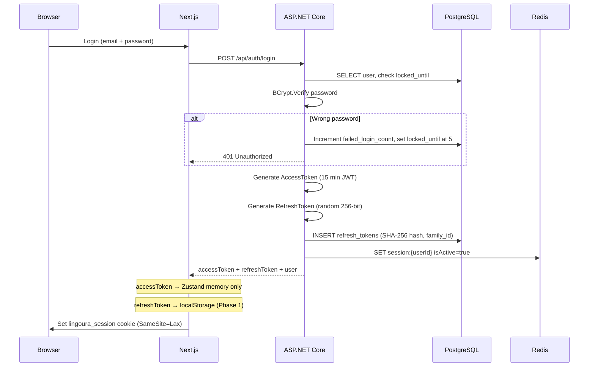
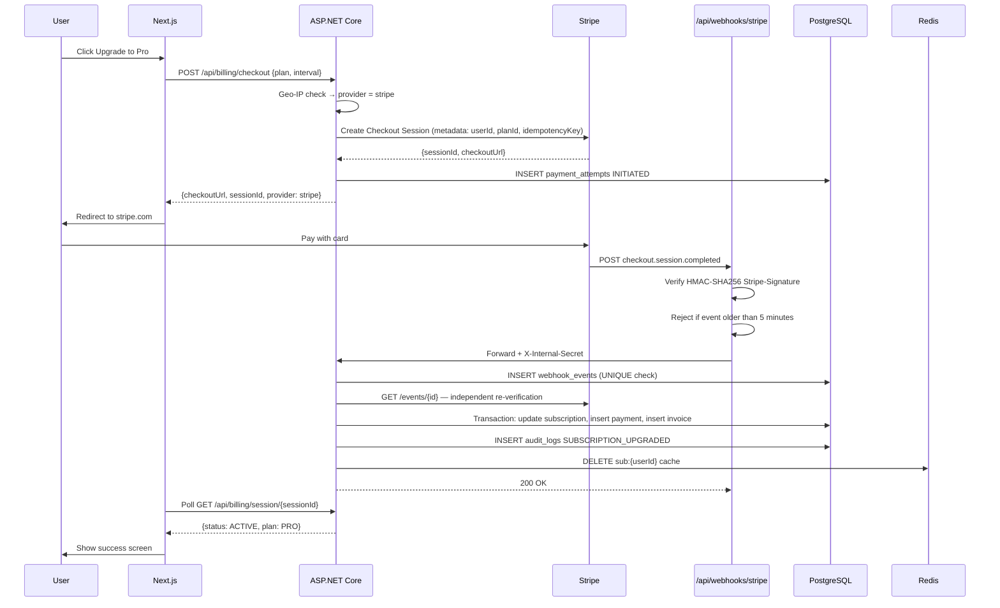
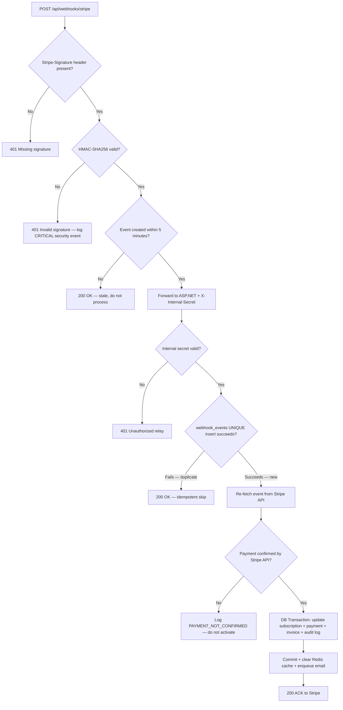
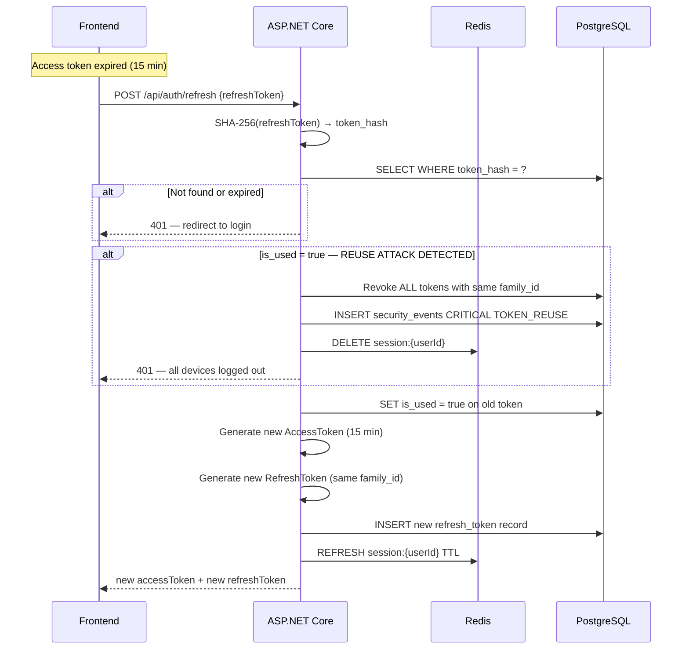

# Payment Security Architecture — Lingoura AI

**Version:** 1.0  
**Date:** 2026-05-18  
**Author:** Principal Security Architect  
**Stack:** Next.js 16 + ASP.NET Core 8 + PostgreSQL + Redis + Stripe + Razorpay

---

## Table of Contents

1. [Executive Summary](#1-executive-summary)
2. [Core Security Principle](#2-core-security-principle)
3. [System Architecture Overview](#3-system-architecture-overview)
4. [Folder Structure](#4-folder-structure)
5. [Database Schema Design](#5-database-schema-design)
6. [Authentication & Token Security](#6-authentication--token-security)
7. [Payment Flow — Stripe (International)](#7-payment-flow--stripe-international)
8. [Payment Flow — Razorpay (India)](#8-payment-flow--razorpay-india)
9. [Webhook Security](#9-webhook-security)
10. [Entitlement & Usage Enforcement](#10-entitlement--usage-enforcement)
11. [Rate Limiting & API Protection](#11-rate-limiting--api-protection)
12. [Threat Model & Attack Prevention](#12-threat-model--attack-prevention)
13. [Admin Security](#13-admin-security)
14. [Monitoring & Alerting](#14-monitoring--alerting)
15. [Frontend Security Rules](#15-frontend-security-rules)
16. [Deployment Security Checklist](#16-deployment-security-checklist)
17. [Architecture Diagrams](#17-architecture-diagrams)
18. [Backend API Reference](#18-backend-api-reference)
19. [Environment Variables](#19-environment-variables)
20. [Scaling Roadmap](#20-scaling-roadmap)
21. [Implementation Phases](#21-implementation-phases)

---

## 1. Executive Summary

Lingoura AI is an AI-powered IELTS preparation platform. It handles real money via two payment providers, sensitive user learning data, and AI model API keys worth thousands of dollars per month. A single security breach could expose user payment data, allow unlimited AI usage for free, or let attackers upgrade their plan without paying.

This document defines the complete production-grade security architecture for the payment and entitlement system. Every decision is made with the assumption that the frontend will be tampered with, tokens will be stolen, and attackers will probe every endpoint.

The architecture follows the same principles used by Stripe, Linear, and Vercel — defense in depth, server-side enforcement, and zero trust on the frontend.

---

## 2. Core Security Principle

**The frontend is display-only. It is never the enforcer.**

This single rule drives every decision in this architecture. A hacker can:

- Edit any JavaScript in the browser DevTools
- Clear or overwrite any localStorage value
- Forge any HTTP request body with any tool
- Replay any API request they intercepted

What a hacker cannot do is forge a valid JWT signed with your server secret, spoof an HMAC-verified webhook from Stripe, or bypass an atomic Redis counter that lives only on your server.

Therefore:

- Plan and subscription status are read from PostgreSQL on every backend request — never from a JWT claim or frontend body
- Payment activation happens only via verified webhooks — never via a frontend success callback
- Quota enforcement is an atomic Redis operation on the backend — the frontend quota display is a UX hint only
- AI provider API keys (OpenAI, Claude, Gemini) never leave the backend

---

## 3. System Architecture Overview

The system is split into two independently deployable services.

**Frontend — Next.js on Vercel**

Handles UI rendering, route guards (UX only), and two specific backend responsibilities: webhook relay and CSRF protection. The frontend has no write access to subscription state. It cannot activate, upgrade, or cancel a subscription on its own.

**Backend — ASP.NET Core 8 on Azure App Service**

This is where all security decisions are made. Every protected endpoint validates the JWT, reads the user's subscription from the database, checks quota via Redis, and writes audit logs. The backend is the only service that talks to Stripe, Razorpay, OpenAI, Claude, and the database.

**Why a relay webhook in Next.js?**

Stripe and Razorpay send webhooks to a public URL. The Next.js relay receives the raw HTTP body, verifies the HMAC signature using the Web Crypto API (Edge Runtime compatible), then forwards the verified payload to the ASP.NET backend with an internal shared secret. The backend then performs a second independent verification by re-fetching the event from the payment provider's API. This double-verification means a fake webhook cannot survive either check.

---

## 4. Folder Structure

**Frontend (Next.js)**

The billing feature lives in `src/features/billing/` and follows the existing feature-driven architecture. Key additions:

- `src/app/api/webhooks/stripe/route.ts` — HMAC verification + relay
- `src/app/api/webhooks/razorpay/route.ts` — HMAC verification + relay
- `src/features/billing/utils/payment-region.ts` — geographic provider detection
- `src/features/billing/hooks/useUsageConsume.ts` — atomic usage consumption mutation
- `src/shared/hooks/useEntitlement.ts` — server-data-driven feature gate

**Backend (ASP.NET Core)**

```
Lingoura.API/
  Controllers/
    AuthController.cs
    SubscriptionsController.cs
    WebhooksController.cs
    UsageController.cs
    AdminController.cs
  Services/
    Auth/         TokenService, RefreshTokenStore
    Billing/      StripeService, RazorpayService, SubscriptionService, PaymentStateMachine
    Entitlement/  EntitlementService, UsageMeteringService
    Webhooks/     StripeWebhookProcessor, RazorpayWebhookProcessor
    Security/     AnomalyDetectionService, AuditService
  Middleware/
    RateLimitingMiddleware
    SecurityHeadersMiddleware
    InternalSecretMiddleware
  Infrastructure/
    Data/LingouraDbContext.cs
    Redis/RedisService.cs
```

---

## 5. Database Schema Design

### Design Decisions

All primary keys are UUIDs generated by PostgreSQL's `pgcrypto` extension. This prevents sequential ID enumeration attacks (an attacker cannot guess `user/1001` after seeing `user/1000`).

Audit logs use a `BIGSERIAL` (sequential integer) primary key because ordering matters for audit trails — you need to know what happened first.

Soft deletes are implemented via a `deleted_at` timestamp column on the `users` table. All indexes on that table include `WHERE deleted_at IS NULL` so soft-deleted rows are invisible to normal queries.

The `webhook_events` table has a `UNIQUE(provider, provider_event_id)` constraint. This is the primary defense against webhook replay attacks — a duplicate event delivery from Stripe simply fails the INSERT and returns an idempotent 200, doing nothing.

### Tables

**users** — Core identity. Stores `password_hash` (BCrypt), `google_id` for OAuth, `locked_until` for brute-force protection, and `failed_login_count`. Password is nullable because Google OAuth users have no password.

**user_profiles** — Separate from users intentionally. Profile data changes frequently (CEFR level, target band, avatar) while auth data changes rarely. Keeping them in separate tables avoids locking the `users` row on every profile update.

**subscription_plans** — Configuration table managed by admins. Stores both USD and INR prices, and both Stripe and Razorpay plan/price IDs. When you add a new plan tier, you insert one row here and the code adapts.

**feature_entitlements** — Per-plan limits for each feature. `limit_value` of -1 means unlimited. `reset_period` is either `daily` or `monthly`. This table is the backend's source of truth for quota limits — not the frontend's `plan-limits.ts` constants.

**subscriptions** — One active subscription per user. Stores both Stripe and Razorpay identifiers in the same row because a user could switch providers when renewing. `status` follows a strict state machine: `ACTIVE → PAST_DUE → GRACE_PERIOD → CANCELED`. `cancel_at_period_end` is set to true when a user requests cancellation — access continues until `current_period_end`.

**payments** — Every successful payment captured here. `idempotency_key` is UNIQUE to prevent double-recording the same payment. The key is generated by the backend when creating the checkout session and stored in Stripe/Razorpay's metadata, then echoed back in the webhook.

**payment_attempts** — Logs every checkout initiation regardless of outcome. Used for fraud detection: if the same IP initiates 10 checkouts in 5 minutes and none succeed, it is flagged.

**webhook_events** — Idempotency store. Before processing any webhook, the backend inserts a row here. If the UNIQUE constraint fails, the event is a duplicate and is safely skipped.

**usage_tracking** — PostgreSQL record of usage per billing period. Redis is the fast-path counter; this table is updated asynchronously and is the source of truth for billing disputes and audits.

**invoices** — Generated after every successful payment. Invoice numbers follow the pattern `LNG-2024-001234`. PDF is stored in Azure Blob Storage; the URL is stored here.

**refresh_tokens** — Never stores the raw token. Only stores `SHA-256(token)` as `token_hash`. `family_id` groups all rotations of the same original token. When a reuse attack is detected (a token is presented after it has already been rotated), the entire family is revoked — all devices using that family's tokens are logged out.

**audit_logs** — Immutable append-only log of every significant action. Includes both `user_id` (who it happened to) and `actor_id` (who did it — relevant for admin actions). `old_value` and `new_value` are JSONB snapshots.

**security_events** — Separate from audit logs. Security events are operational alerts: failed logins, CSRF violations, rate limit breaches, token reuse. These feed the monitoring dashboard.

### Key Indexes

The most important indexes for performance and security:

- `refresh_tokens(token_hash)` — hash lookup on every auth request, must be instant
- `refresh_tokens(family_id)` — revoke entire family on reuse detection
- `webhook_events(provider, provider_event_id)` UNIQUE — prevents replay attacks
- `subscriptions(current_period_end) WHERE status IN (...)` — renewal job queries this daily
- `security_events(ip_address)` — fraud detection queries by IP
- `audit_logs(created_at DESC)` — audit trail is always read most-recent-first

---

## 6. Authentication & Token Security

### Token Architecture

Two tokens are issued at login: a short-lived access token and a longer-lived refresh token.

**Access Token** — JWT signed with HS256, valid for 15 minutes. Stored in Zustand memory (JavaScript variable). Clears when the tab closes. Cannot be stolen by XSS if kept in memory (attackers would need to execute code in the page context at the exact moment the token is in memory, and it would expire 15 minutes later regardless).

**Refresh Token** — Random 256-bit value, valid for 7 days. Currently stored in localStorage (known XSS risk — Phase 2 migration to HttpOnly cookie planned). The raw token is never stored in the database — only `SHA-256(token)` is stored as `token_hash`.

**Why not store the plan in the JWT?**

If the plan is a JWT claim, anyone who forges a token (or whose token is leaked) can claim any plan. The backend would have to re-verify against the database anyway to be safe — so the JWT claim adds risk with no benefit. Every protected endpoint reads the user's subscription from PostgreSQL (or from Redis cache with a 5-minute TTL).

### Refresh Token Rotation

Every time a refresh token is used, it is immediately marked as `is_used = true` and a new token is issued with the same `family_id`. This is called rotation.

If a token is presented after it has already been marked as used, this indicates either a replay attack or that the original token was stolen. The system responds by revoking the entire family — every device using any token in that family is immediately logged out. A security event of severity CRITICAL is logged.

### Account Lockout

After 5 failed login attempts, the account is locked for 15 minutes by setting `locked_until` in the database. This prevents brute force and credential stuffing. The lockout period is visible in the API response so the frontend can show a countdown.

### Session Revocation

For immediate revocation without waiting for the JWT to expire, the backend maintains a Redis session store at `session:{userId}`. On every authenticated request, the JWT bearer handler checks this key. If the key is missing or `isActive` is false, the token is rejected even if it has not expired yet. This is how logout works — it deletes the Redis key, making all existing tokens invalid within seconds.

---

## 7. Payment Flow — Stripe (International)

The flow is designed so that the frontend never makes a security decision about payment success. Here is the exact sequence:

**Step 1 — User clicks Upgrade**

The frontend calls `POST /api/billing/checkout` with the desired plan and billing interval. It also sends a provider hint based on geographic detection, but this hint is never trusted by the backend.

**Step 2 — Backend creates Checkout Session**

The backend determines the payment provider using server-side geo-IP lookup, ignoring the client hint entirely. It generates an `idempotencyKey` (UUID) and stores it. It calls the Stripe API to create a Checkout Session, embedding `userId`, `planId`, and `idempotencyKey` in the session metadata. It logs a `payment_attempts` record with status `INITIATED`. It returns the `checkoutUrl` to the frontend.

**Step 3 — User pays on Stripe**

The frontend redirects to `stripe.com/checkout`. The user enters their card. Stripe handles all PCI-sensitive data. The frontend never sees card numbers.

**Step 4 — Webhook arrives**

Stripe sends a `checkout.session.completed` webhook to `/api/webhooks/stripe`. The Next.js handler verifies the HMAC-SHA256 signature. It checks the event timestamp (rejects if older than 5 minutes). It forwards the raw body to the ASP.NET backend with an `X-Internal-Secret` header.

**Step 5 — Backend processes webhook**

The backend validates the internal secret. It attempts to insert a row into `webhook_events` — if the UNIQUE constraint fails, it is a duplicate and is skipped (idempotent). It re-fetches the event directly from the Stripe API as an independent second verification. It opens a database transaction, updates the subscription to the new plan, records the payment, generates an invoice, and writes an audit log. It commits the transaction. It deletes the Redis subscription cache so the next request reads fresh data. It enqueues a welcome email.

**Step 6 — Frontend polls for confirmation**

The frontend polls `GET /api/billing/session/{sessionId}` every 2 seconds for up to 30 seconds. The backend checks whether the subscription for that session has been activated. When it finds `status: ACTIVE`, the frontend shows the success screen.

The user never sees the dashboard with the new plan until the backend confirms it — there is no "optimistic upgrade".

---

## 8. Payment Flow — Razorpay (India)

The Razorpay flow is nearly identical in security architecture. The key differences are in how the checkout modal works.

**Step 1 — Backend creates Order**

Instead of a Stripe Checkout Session, the backend creates a Razorpay Order via `POST /orders`. The order amount is in paise (INR smallest unit). The backend embeds `userId`, `planId`, and `idempotencyKey` in the order's `notes` object.

**Step 2 — Frontend opens Razorpay Modal**

The backend returns the Razorpay `orderId`, `amount`, `currency`, and the public `keyId`. The frontend calls `openRazorpayCheckout()` which initialises the Razorpay.js SDK with these values. The modal opens in an iframe.

**Step 3 — Payment Handler**

When the user completes payment, Razorpay calls the `handler` function with `{razorpay_payment_id, razorpay_order_id, razorpay_signature}`. The frontend does NOT activate the subscription here. It dispatches a browser custom event so the calling component knows payment was attempted, and then waits for the webhook to confirm.

**Step 4 — Webhook verification**

Razorpay's webhook signature is `HMAC-SHA256(webhookSecret, rawBody)` encoded as a hex string in the `X-Razorpay-Signature` header. The Next.js handler verifies this using the Web Crypto API. The backend re-fetches the payment from `GET /payments/{id}` on the Razorpay API and verifies the `order_id` matches the stored record for that user.

---

## 9. Webhook Security

Webhooks are the most security-sensitive part of the payment system. An attacker who can make the backend believe a fake payment was made gets an unlimited subscription for free.

### Why Frontend Callback is Dangerous

When Stripe or Razorpay redirects back to your success URL, or calls your `handler` function, that callback is running in the browser. It can be triggered by:

- Navigating directly to the success URL
- Calling the handler function with fake payment IDs in DevTools
- Replaying a captured success redirect

None of these trigger the webhook. The webhook is a server-to-server POST from Stripe/Razorpay's own infrastructure, signed with a secret that only your server knows.

### Double Verification

Every webhook goes through two independent checks:

First check is in the Next.js relay. The raw body (bytes, not parsed JSON) is verified against the `Stripe-Signature` or `X-Razorpay-Signature` header using HMAC-SHA256. This check uses a constant-time comparison function to prevent timing attacks (an attacker cannot determine how close their forged signature is by measuring response time).

Second check is in the ASP.NET backend. The backend re-fetches the event ID directly from the Stripe or Razorpay API. This means even if an attacker somehow passes the HMAC check with a real event ID they captured from a previous legitimate webhook, the backend will re-verify the payment status directly. A captured event for a $19 payment cannot be replayed to trigger a second subscription activation because the `webhook_events` table's UNIQUE constraint blocks the second insert.

### Idempotency

Stripe guarantees "at least once" delivery — they may send the same webhook multiple times if they don't receive a timely 200 response. The `webhook_events` table's `UNIQUE(provider, provider_event_id)` constraint makes duplicate processing impossible. The second delivery simply fails the INSERT and returns 200 without doing anything.

---

## 10. Entitlement & Usage Enforcement

### How It Works

Every AI feature endpoint on the backend calls `EntitlementService.ConsumeAsync(userId, feature, idempotencyKey)` before doing any work.

The service reads the user's subscription from PostgreSQL (cached in Redis for 5 minutes). It loads the plan limit from the `feature_entitlements` table. If the limit is -1, it returns `Unlimited`. Otherwise, it performs an atomic Redis `INCR` on the key `usage:{userId}:{feature}:{period}`, sets an expiry on the first use of the period, and compares the new count to the limit. If over limit, it decrements the counter (to undo the increment) and returns `QuotaExceeded`. If under limit, it marks the idempotency key in Redis (24-hour TTL) to prevent double-counting on retries, and triggers an async update to the `usage_tracking` database table.

### Why Redis and Not Just the Database

A database `UPDATE usage_count = usage_count + 1` would require a row-level lock on every AI request. At scale, this creates a bottleneck — thousands of concurrent users all contending on the same row. Redis `INCR` is atomic at the memory level and handles hundreds of thousands of operations per second without locking.

The database is updated asynchronously as a write-behind cache. It is the source of truth for billing disputes and audits, not for real-time enforcement.

### Frontend Role

The frontend's `useEntitlement` hook reads usage data that was fetched from the server via `GET /api/billing/usage`. It uses this data to show progress bars, remaining counts, and to optimistically block interactions before the user hits the server limit. This is purely a UX improvement — it prevents the user from clicking "Start AI Chat" when they clearly have no quota left.

If the frontend gate is bypassed (by editing JavaScript, clearing state, or using a custom HTTP client), the backend rejects the request with `429 Too Many Requests`. The frontend cannot grant access; it can only display information.

### Usage Features Tracked

Each feature has its own quota and reset period:

- `ai_chats` resets daily (FREE: 5, PRO: 100, ELITE: 300)
- `speaking_sessions` resets monthly (FREE: 2, PRO: 30, ELITE: 100)
- `mock_tests` resets monthly (FREE: 1, PRO: 10, ELITE: 30)
- `writing_submissions` resets monthly (FREE: 2, PRO: 20, ELITE: 100)
- `vocabulary_words` resets daily (FREE: 10, PRO: 50, ELITE: unlimited)

---

## 11. Rate Limiting & API Protection

### Strategy

Rate limiting runs at two levels. The outer level uses Azure Front Door (WAF) to rate limit by IP at the network edge before requests reach the application. The inner level is a Redis-based sliding window rate limiter in ASP.NET Core middleware.

Different endpoints have different policies. Auth endpoints (login, register) are rate limited by IP address because unauthenticated attackers don't have a user ID. All other endpoints are rate limited by user ID, which is more precise and cannot be bypassed by rotating IP addresses.

### Policies

Login: 5 attempts per IP per minute. Register: 3 per IP per minute. Checkout creation: 5 per user per minute. Subscription cancel: 3 per user per hour (prevents abuse of cancel/reactivate cycle). AI chat: 30 per user per minute as an inner limit (the daily quota is the outer limit). General API: 300 requests per user per minute.

### Protecting AI Provider Keys

OpenAI, Claude, and Gemini API keys are stored in Azure Key Vault. They are loaded into the ASP.NET process at startup via Azure Key Vault references in the app configuration. They never appear in the frontend bundle, environment variables exposed to the client, or logs.

All AI calls are proxied through ASP.NET endpoints. The frontend calls `POST /api/ai/chat` with the user's message and a valid JWT. The backend validates the JWT, checks entitlement, constructs the AI provider request with the server-side key, and returns the response. The frontend has no idea which AI model is being used or what the API key is.

---

## 12. Threat Model & Attack Prevention

### Fake Webhook Attack

An attacker POSTs a crafted payment event to `/api/webhooks/stripe` claiming a successful $39 payment.

Prevention: The HMAC-SHA256 signature cannot be forged without the webhook secret. Even if they somehow pass the signature check using a real event ID they captured from a previous legitimate webhook, the backend's second check (re-fetching from Stripe API) will verify the actual payment status. And the `webhook_events` UNIQUE constraint prevents the same event from being processed twice.

### Replay Attack

An attacker captures a legitimate webhook from a previous payment and replays it to get a second subscription activation.

Prevention: The `webhook_events` table has `UNIQUE(provider, provider_event_id)`. The second insert fails. Additionally, the Stripe relay rejects events older than 5 minutes based on the `created` timestamp.

### Subscription Spoofing

An attacker sends `PATCH /api/billing/subscription` with `{plan: "ELITE"}` in the request body.

Prevention: No such endpoint exists. Plan changes are only triggered by the webhook processor after payment verification. There is no API endpoint that accepts a plan name from the frontend and applies it.

### Frontend Tampering

A user opens DevTools, edits their Zustand store to set `plan: "ELITE"`, and tries to access elite features.

Prevention: The frontend store is display-only. Every backend endpoint reads the subscription from PostgreSQL. The Zustand store is not sent to the backend — the JWT does not contain the plan. The user will see the Elite UI for a few seconds until the next API call returns their actual plan.

### Token Theft via XSS

A malicious script injected via an XSS vulnerability reads the refresh token from localStorage.

Prevention: Access tokens live in Zustand memory (not localStorage) and expire in 15 minutes. The refresh token in localStorage is a known risk — the Phase 2 plan migrates it to an HttpOnly cookie that JavaScript cannot read at all. Even if the refresh token is stolen, the attacker must use it before the legitimate user does — and the first use marks it as used, so the legitimate user's next refresh detects the reuse, revokes the entire family, and forces a re-login on all devices.

### CSRF Attack

An attacker's website makes a POST request to `/api/billing/checkout` using the victim's session cookies.

Prevention: The CSRF double-submit cookie pattern in `middleware.ts` requires every mutation to include an `X-CSRF-Token` header that matches the `lingoura_csrf` cookie. The cookie has `SameSite=Strict`, so it is not sent cross-origin. An attacker's page cannot read our cookies, cannot construct the header, and the request fails with 403.

### Credential Stuffing

An attacker uses a list of leaked email/password combinations to try logging in.

Prevention: Redis rate limiter blocks more than 5 attempts per IP per minute. After 5 failed attempts for a specific account, `locked_until` is set in the database for 15 minutes. BCrypt with cost factor 12 makes each password check take ~250ms, making large-scale attacks computationally expensive.

### Payment Replay (Razorpay)

An attacker captures a `razorpay_payment_id` from a legitimate transaction and submits it for a different order.

Prevention: The backend verifies that the `order_id` in the payment record matches the stored checkout session for that user and plan. Razorpay's payment signature covers the specific `order_id`, so a payment for order A cannot be presented as payment for order B.

### SQL Injection

Malicious input in API parameters attempts to manipulate database queries.

Prevention: EF Core uses parameterised queries exclusively. All user input is validated by FluentValidation before reaching the service layer. Raw SQL is not used anywhere.

### Man-in-the-Middle (MITM)

An attacker intercepts traffic between the user and the server to steal tokens.

Prevention: HSTS with `preload` and `max-age=31536000` instructs browsers to only connect via HTTPS for one year, even on the first visit (once the domain is in the preload list). TLS 1.2 minimum is enforced by Azure App Service. There is no HTTP endpoint.

### Session Fixation

An attacker sets a known session cookie on the victim's browser and waits for them to log in.

Prevention: On every successful login, new access and refresh tokens are generated. The previous session is invalidated. The session cookie is regenerated. There is no way to force a user to adopt a session the attacker knows.

---

## 13. Admin Security

Admins have elevated privileges and require additional protection.

Admin endpoints are protected by a separate `[Authorize(Roles = "admin")]` attribute. Every admin action is logged in `audit_logs` with both the `actor_id` (admin) and `user_id` (target user).

**Admin impersonation** is logged separately. When an admin views another user's data, the `audit_logs` record explicitly identifies it as an impersonation event. This creates an accountability trail.

**Sensitive actions** (issuing refunds, manually changing subscription plan, banning accounts) require a second approval from another admin above a certain threshold. This is implemented as a pending action queue with a 15-minute approval window.

**Feature flags** allow new features to be deployed to production but kept off for all users until explicitly enabled. They are managed via an admin API and stored in PostgreSQL, not in environment variables.

---

## 14. Monitoring & Alerting

### What is Monitored

Failed login attempts — more than 20 per minute on a single account triggers a CRITICAL security event and automatic lockout extension.

Webhook failures — if the Next.js relay cannot reach the ASP.NET backend, or the backend returns a non-200, Stripe will retry. But we also alert in Slack after 3 consecutive failures on the same event.

Subscription anomalies — if a user's plan changes without a corresponding payment record, a CRITICAL audit log is written and an alert is sent.

AI usage spikes — if a single user's AI consumption is 10x their historical average in one hour, it is flagged for manual review. This catches API key theft or account sharing.

Payment attempt velocity — more than 5 checkout initiations from one IP in 5 minutes triggers a fraud alert.

Token reuse detection — any token reuse event triggers an immediate Slack/PagerDuty alert because it definitively indicates either a stolen token or a bug.

### Tools

Serilog writes structured JSON logs with correlation IDs on every request. These logs flow into an Azure Log Analytics Workspace.

OpenTelemetry instruments the ASP.NET application for distributed traces — you can see the full trace of a webhook from the Next.js relay through the ASP.NET processor to the database commit.

Application Insights provides the alerting layer. Custom metrics are tracked for payment success rate, webhook processing latency, and AI quota utilisation.

Azure Monitor fires alert rules when thresholds are exceeded. Alerts go to PagerDuty for CRITICAL severity and to a Slack `#security-alerts` channel for HIGH severity.

---

## 15. Frontend Security Rules

These rules must never be violated, regardless of deadline pressure.

**Never store plan state in localStorage or sessionStorage.** The subscription store (Zustand) is in memory. If the user refreshes, the plan is re-fetched from the server. This prevents local manipulation.

**Never trust the success callback from Stripe or Razorpay.** The `handler` function and the `?success=true` URL parameter are not authoritative. They are a UX hint only. The frontend must poll the backend to confirm activation.

**Never expose API keys in the frontend bundle.** No `NEXT_PUBLIC_OPENAI_KEY`, no `NEXT_PUBLIC_RAZORPAY_SECRET`. Public keys (Razorpay's `key_id`, Stripe's `publishableKey`) are safe to expose — they are designed to be public. Secret keys are never public.

**Route guards are UX only.** The `middleware.ts` redirect to `/login` for unauthenticated users is a convenience, not a security boundary. The backend must validate the JWT on every protected endpoint regardless.

**CSP headers restrict what can run.** The Content Security Policy in `next.config.ts` prevents inline scripts from unknown sources, limits which domains can be connected to, and blocks iframe embedding. This is the primary XSS mitigation layer.

**CSRF token must be sent on every mutation.** The axios interceptor should read the `lingoura_csrf` cookie and set the `X-CSRF-Token` header on every POST, PUT, PATCH, and DELETE request. Without this, the request will be rejected by middleware with 403.

---

## 16. Deployment Security Checklist

**Before going live, verify every item on this list.**

Infrastructure:
- HTTPS enforced on all domains — no HTTP endpoint exists
- HSTS enabled with preload, includeSubDomains, max-age one year
- Azure Front Door WAF enabled with OWASP 3.2 rule set
- Azure DDoS Protection Standard enabled on the virtual network
- Database has no public IP — accessible only via private VNet
- Redis has no public access — TLS port 6380, private VNet
- All secrets in Azure Key Vault — zero secrets hardcoded in code or environment files checked into version control
- CI/CD pipeline scans for secrets using truffleHog or similar

Authentication:
- Access token expiry is 15 minutes or less
- Refresh token stored in HttpOnly cookie (Phase 2 — localStorage in Phase 1)
- Refresh token reuse detection is active and tested
- Google OAuth `aud` claim is validated against your client ID
- Account lockout after 5 failures is tested

Payment:
- Stripe webhook secret is set in Vercel environment (not in code)
- Razorpay webhook secret is set in Vercel environment
- Backend internal secret is set in both Vercel and Azure Key Vault
- Webhook endpoint tested with Stripe CLI and Razorpay dashboard test webhooks
- Duplicate webhook delivery tested — confirm idempotent (no double charge)
- Plan not included in JWT — confirmed by inspecting a real token at jwt.io

API:
- Rate limiting tested — confirm 429 returned after limit exceeded
- CSRF protection tested — confirm 403 returned when header is missing
- All AI endpoints return 402 when subscription is not active
- All AI endpoints return 429 when quota is exceeded
- AI provider keys are not in any frontend bundle (use `npm run build && grep -r "sk-" .next/`)

Monitoring:
- Application Insights connected and receiving traces
- At least one alert rule configured for payment failure spike
- Serilog logs flowing into Log Analytics Workspace
- Test that a failed login generates a security_event record

---

## 17. Architecture Diagrams

### Authentication Flow



### Subscription Purchase Flow (Stripe)



### Webhook Verification Decision Flow



### Refresh Token Rotation & Reuse Detection



### Entitlement Enforcement (AI Feature Gate)

```mermaid
flowchart TD
  A[User starts AI Speaking Session] --> B[Frontend useEntitlement check]
  B -->|Quota shows 0| C[Show UpgradeModal — UX block only]
  B -->|Quota shows available| D[POST /api/usage/consume with idempotencyKey]
  D --> E[Backend validates JWT]
  E --> F[Read subscription from DB or Redis cache]
  F --> G{Status ACTIVE or TRIALING?}
  G -->|No| DENY1[402 Payment Required]
  G -->|Yes| H[Read plan limit from feature_entitlements table]
  H --> I{Limit = -1?}
  I -->|Yes — unlimited| ALLOW[200 OK — proceed]
  I -->|No| J[Redis INCR usage:{userId}:{feature}:{period}]
  J --> K{Count exceeds limit?}
  K -->|Yes| DENY2[429 Too Many Requests — decrement Redis counter]
  K -->|No| L[Mark idempotency key in Redis — 24h TTL]
  L --> M[Async update usage_tracking in DB]
  M --> ALLOW
  ALLOW --> N[Process AI request — key injected server-side]
  N --> O[Return response to user]
```

---

## 18. Backend API Reference

### Authentication Endpoints

`POST /api/auth/register` — Creates user, assigns FREE plan, logs audit event. Rate limited by IP. Validates email format and password strength via FluentValidation.

`POST /api/auth/login` — Verifies credentials, checks lockout, generates token pair. Rate limited at 5 per IP per minute.

`POST /api/auth/refresh` — Rotates refresh token. Detects reuse. Returns new token pair.

`POST /api/auth/logout` — Revokes refresh token family, deletes Redis session. Invalidates all tokens for the device.

### Subscription Endpoints

`GET /api/billing/subscription` — Returns current subscription. Reads from DB (Redis cached 5 min). Requires valid JWT.

`POST /api/billing/checkout` — Creates Stripe or Razorpay checkout. Determines provider via geo-IP, not client hint. Logs payment attempt.

`DELETE /api/billing/subscription/cancel` — Sets `cancel_at_period_end = true`. Access continues until period end. Rate limited at 3 per hour.

`POST /api/billing/subscription/reactivate` — Clears `cancel_at_period_end` if period has not ended. Calls Stripe/Razorpay to resume subscription.

`GET /api/billing/session/{sessionId}` — Polls checkout session status. Used by frontend to confirm activation without trusting the redirect callback.

### Webhook Endpoints (ASP.NET Core — called by Next.js relay)

`POST /api/payments/webhook/stripe` — Requires `X-Internal-Secret` header. Inserts into `webhook_events`, re-verifies with Stripe API, runs state machine.

`POST /api/payments/webhook/razorpay` — Same pattern for Razorpay.

### Usage Endpoints

`GET /api/usage/current` — Returns current usage for all features in the billing period. Reads from Redis with DB fallback.

`POST /api/usage/consume` — Atomically consumes one unit of a feature. The only write path to usage counters. Requires JWT + idempotency key.

### Admin Endpoints

`GET /api/admin/payments` — Paginated payment history with filters. Requires admin role.

`GET /api/admin/security-events` — Security event stream with severity filter. Requires admin role.

`POST /api/admin/subscriptions/{userId}/override` — Manual plan override for support cases. Requires two-admin approval. Writes audit log with both actor and target.

All admin endpoints log to `audit_logs` with `actor_id` set to the authenticated admin's user ID.

---

## 19. Environment Variables

Variables prefixed with `NEXT_PUBLIC_` are visible in the browser bundle. Never put secrets there.

**Vercel (Next.js)**

- `NEXT_PUBLIC_API_URL` — the ASP.NET Core API base URL
- `NEXT_PUBLIC_APP_URL` — the Next.js app URL (used for success/cancel URLs)
- `STRIPE_WEBHOOK_SECRET` — Stripe webhook signing secret (not NEXT_PUBLIC)
- `RAZORPAY_WEBHOOK_SECRET` — Razorpay webhook secret (not NEXT_PUBLIC)
- `BACKEND_INTERNAL_SECRET` — shared secret between Next.js relay and ASP.NET backend

**Azure App Service (ASP.NET Core — referenced from Key Vault)**

- `Jwt__Secret` — 256-bit random HS256 signing key
- `Stripe__SecretKey` — Stripe secret API key (`sk_live_...`)
- `Stripe__WebhookSecret` — same as `STRIPE_WEBHOOK_SECRET` above
- `Razorpay__KeyId` — Razorpay public key ID (`rzp_live_...`)
- `Razorpay__KeySecret` — Razorpay secret key (never exposed to frontend)
- `Razorpay__WebhookSecret` — same as `RAZORPAY_WEBHOOK_SECRET` above
- `InternalWebhookSecret` — same as `BACKEND_INTERNAL_SECRET` above
- `ConnectionStrings__DefaultConnection` — PostgreSQL connection string
- `Redis__ConnectionString` — Azure Cache for Redis connection string
- `OpenAI__ApiKey` — OpenAI API key
- `Anthropic__ApiKey` — Claude API key (never NEXT_PUBLIC)

---

## 20. Scaling Roadmap

The system is designed for progressive scaling without architectural rewrites.

At 0–10,000 active users, a single PostgreSQL instance and a single Redis instance are sufficient. ASP.NET Core on a single App Service plan handles the load.

At 10,000–100,000 active users, add a PostgreSQL read replica for analytics and reporting queries. Redis stays as a single instance (Azure Cache for Redis Basic handles ~250,000 operations per second). Add a second App Service instance behind Azure Front Door.

At 100,000+ active users, partition the `audit_logs` table by month (PostgreSQL declarative partitioning). Add Redis cluster mode. Move webhook processing to Azure Service Bus so it is decoupled from the HTTP request. The webhook endpoint inserts a message into the queue and returns 200 immediately; a separate Azure Function processes the queue.

At 1,000,000+ active users, consider sharding the `usage_tracking` table by user ID range, and introduce a separate read-optimised analytics database (Redshift or Azure Synapse) for the admin dashboard so reporting queries don't compete with transactional queries.

---

## 21. Implementation Phases

### Phase 1 — Complete (this branch)

All frontend security hardening is shipped:

- CSP headers with Stripe and Razorpay domains in `next.config.ts`
- HSTS with preload in production
- CSRF double-submit cookie in `middleware.ts`
- Stripe webhook handler with HMAC verification
- Razorpay webhook handler with HMAC verification
- Razorpay types and geographic provider detection
- Server-validated entitlement hook
- Atomic usage consume mutation with idempotency
- ELITE added to `canUpgradeTo` order

### Phase 2 — Token Hardening (next sprint)

Move the refresh token from localStorage to an HttpOnly, SameSite=Strict, Secure cookie. This eliminates the last XSS-accessible credential from the browser. The ASP.NET refresh endpoint will read the token from the cookie instead of the request body. The Next.js axios interceptor will no longer need to send the refresh token manually — the cookie is sent automatically by the browser.

### Phase 3 — Backend Entitlement (parallel to Phase 2)

Implement `EntitlementService.ConsumeAsync` on every AI and premium feature endpoint. Deploy the Redis usage counter with period-aligned expiry. Wire the `feature_entitlements` table as the source of truth for limits.

### Phase 4 — Fraud Detection

Build the payment velocity checker. Add geo-IP mismatch detection between login location and payment location. Create the anomaly scoring service. Wire alerts to PagerDuty.

### Phase 5 — Enterprise Hardening

Add mTLS between the Next.js webhook relay and the ASP.NET backend (replaces the shared internal secret). Implement signed audit log hashes for tamper detection. Complete SOC 2 Type II controls documentation. Verify PCI DSS SAQ-A compliance.

---

*This document is a living specification. Update it whenever the payment flow, token strategy, or entitlement model changes. Security decisions must be documented with their reasoning — future engineers must understand WHY a rule exists to know when it is safe to change it.*
